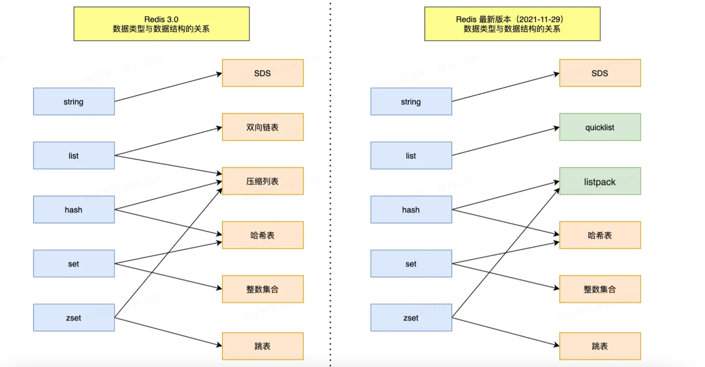

# 数据结构总览

Redis 提供了丰富的数据类型，常见的有五种：

- **String（字符串）**

- **Hash（哈希）**

- **List（列表）**

- **Set（集合）**

- **Zset（有序集合）**

随着 Redis 版本的更新，后面又支持了四种数据类型： 

- **BitMap（2.2 版新增）**
- **HyperLogLog（2.8 版新增）**
- **GEO（3.2 版新增）**
- **Stream（5.0 版新增）**

redis对象和底层数据结构关系:

redis全局数据结构组织图：

redis对象：

